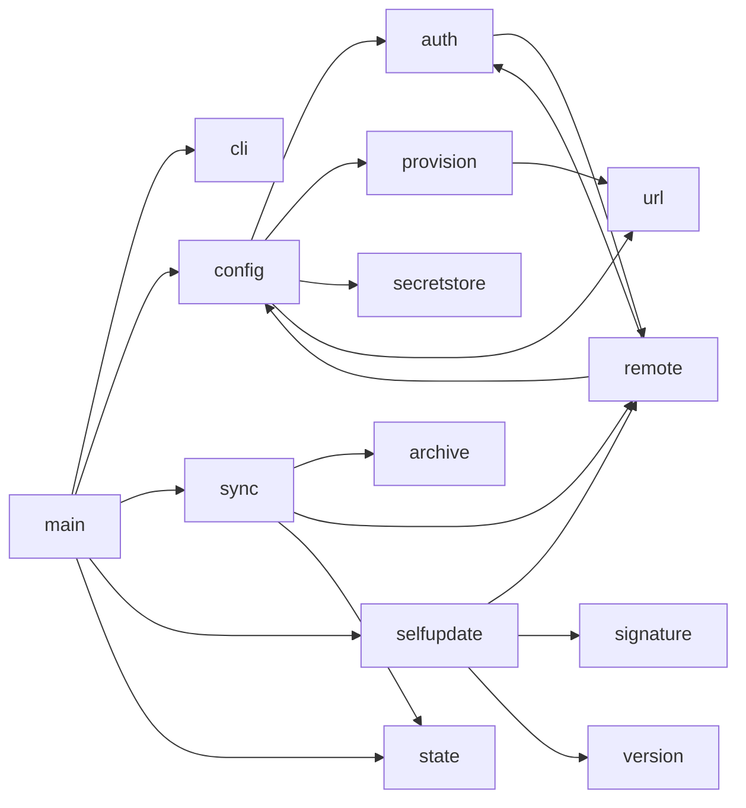

# Architecture

`brainmaker` is one Rust binary with fourteen modules. It has no background process, no plugin
system, and no local database. One invocation loads settings, gets one access token, makes at most
three further HTTP requests, writes the filesystem, and exits.

A second binary, `brainmaker-sign`, lives in [`tools/sign.rs`](../tools/sign.rs). It builds only
under the `sign` feature and never ships.

## Components

| Module | Role | Depends on |
|---|---|---|
| [`src/main.rs`](../src/main.rs) | Entry point, command dispatch, all `stdout` output | every module |
| [`src/cli.rs`](../src/cli.rs) | Argument parsing and the help text | none |
| [`src/config.rs`](../src/config.rs) | Settings load, paths, route and URL building, credential checks, size limits, hash validation | `auth`, `provision`, `secretstore`, `url` |
| [`src/auth.rs`](../src/auth.rs) | The OAuth2 client-credentials exchange, and the access token cache | `config`, `remote`, `ureq` |
| [`src/url.rs`](../src/url.rs) | URL origin parsing, and the rule that a base URL must use TLS | none |
| [`src/provision.rs`](../src/provision.rs) | Provisioning file discovery, parsing, validation | `url` |
| [`src/secretstore.rs`](../src/secretstore.rs) | Seal and open the stored settings, restrict file modes | `ring`, `dirs` |
| [`src/remote.rs`](../src/remote.rs) | HTTP GET as text, and streamed download to a file | `auth`, `config`, `ureq` |
| [`src/sync.rs`](../src/sync.rs) | Version compare, install, directory swap | `archive`, `config`, `remote`, `state` |
| [`src/archive.rs`](../src/archive.rs) | Zip extraction and its safety checks | `config`, `zip` |
| [`src/state.rs`](../src/state.rs) | `state.json` read and atomic write | `serde_json` |
| [`src/selfupdate.rs`](../src/selfupdate.rs) | Envelope and manifest parse, checksum, binary swap | `config`, `remote`, `signature`, `version`, `sha2` |
| [`src/signature.rs`](../src/signature.rs) | Ed25519 check of the manifest, and the trusted public keys | `ring` |
| [`src/version.rs`](../src/version.rs) | Version string comparison and validation | none |

## Module graph



## Boundaries

Four boundaries separate the trusted code from data it does not control.

| Boundary | Crossed by | Enforced in |
|---|---|---|
| Network to disk | The content hash, the zip archive, the software manifest, the replacement binary | `signature::verify`, `config::validate_hash`, `archive::extract`, `version::validate`, `Build::checksum` |
| Network to a header | The access token | `auth::check_token`, which refuses a token that holds a control character |
| Provisioning file to store | The endpoints and the client credentials | `provision::parse`, `Settings::validate`, `provision::check_credential_set`, `url::check_base_url`, `Credentials::new` |
| Store to process | The sealed settings | `secretstore::open`, which authenticates the file before it returns bytes |

Only `remote.rs` and `auth.rs` open a socket, and both build the agent through `remote::build_agent`,
so one place sets the timeouts and the user agent. Only `secretstore.rs` holds key material. Only `url.rs` reads the
scheme, host, and port of a URL, so both base-URL checks cannot drift apart.
Only `main.rs` prints to `stdout`; every other module reports through `anyhow::Result` or through
the injected `log` closure.

## Data model

### On-disk layout

```text
~/.brainmaker/
├── confidential/       0700
│   └── config.enc      0600, the sealed endpoints, routes, and credentials
├── content/            the extracted content
└── state.json          {"hash": "...", "updated_at_unix": ...}
```

`brainmaker` also creates `.staging/`, `.trash/`, and `.download.zip` under the root while it
works, and removes all three before it exits, on success and on failure alike. `content/` is
replaced on every update, so keep your own files elsewhere.

`self-update` writes `.brainmaker-update-<pid>` and `.brainmaker-old` beside the binary, and
removes both before it exits. On Windows both carry the `.exe` suffix.

### `state.json`

| Field | Type | Meaning |
|---|---|---|
| `hash` | string | Hash of the archive that produced the current `content/` |
| `updated_at_unix` | integer | Seconds since the Unix epoch at the last successful install |

A missing or corrupt file reads as `None`, which the caller treats as "not installed". That is not
an error: the reinstall repairs the state.

### `config.enc`

| Offset | Bytes | Content |
|---|---|---|
| 0 | 5 | The magic `BMKR1`, which also serves as the AEAD additional authenticated data |
| 5 | 12 | The random nonce |
| 17 | rest | AES-256-GCM ciphertext and tag over the `KEY=VALUE` text |

### Settings source

`Config::load` records where this run's settings came from, and `status` prints it.

| Source | Meaning |
|---|---|
| `Imported` | A provisioning file was found and imported during this run |
| `Stored` | The sealed store held the settings |
| `Environment` | The environment supplied the base URL, and no store was needed |

The routes live in the same store, and the environment overrides one route at a time.

## Decisions and tradeoffs

### No endpoint is compiled into the binary

Every URL arrives in a provisioning file. The test
`config::tests::no_endpoint_is_compiled_into_this_module` reads `config.rs` at compile time and
fails when a scheme is followed by a host character outside the test module.
`auth::tests::no_endpoint_is_compiled_into_this_module` does the same for `auth.rs`, and
`cli::tests::the_help_text_names_no_endpoint` does the same for the help text.

The tradeoff: a fresh binary cannot do anything on its own, and the first run must find a file.

### The manifest is signed, and the signature covers the served bytes

The trust anchor for `self-update` is an Ed25519 signature, not the TLS connection. The route
returns an envelope whose `payload` field is the manifest as a JSON string, and whose `signature`
field covers exactly those bytes.

Carrying the manifest as a string, rather than as a nested object, keeps JSON canonicalisation out
of the security argument: the client verifies bytes, then parses them. One route rather than a
sibling `.sig` route means one upload, so no client can fetch a new manifest with an old signature.
Hexadecimal rather than base64 avoids a new dependency.

The tradeoffs: the route body is no longer readable at a glance with `curl`, and any proxy that
reformats the JSON breaks every client.

### The public key is committed, the private key is not

`PUBLIC_KEYS` in [`src/signature.rs`](../src/signature.rs) holds the keys this binary trusts. The
key is public, so unlike `BRAINMAKER_CONFIG_KEY` it lives in the repository, and rotating it is a
code change plus a release. The list holds more than one key so that a rotation does not break
clients that have not updated yet.

The tradeoff: a build whose list is empty refuses every manifest. That fails closed, and it makes
`self-update` inert until an operator generates a key. The release workflow fails rather than ship
such a binary.

### A base URL must use TLS, unless it names this machine

`brainmaker` sends the client secret to the token endpoint and the bearer token on every API
request, so `url::check_base_url` requires `https://`. It allows `http://` only when the host is
`localhost` or a loopback address, because the credential then never reaches the network. The rule
covers `BRAINMAKER_API_BASE`, `SWETSI_JWT_ENDPOINT`, and `--url`, so
`--url http://localhost:8080` still works for a local test server.

The tradeoff: a staging server on plain HTTP and a routable address no longer works, and an
operator must give it a certificate or run it on the loopback interface.

### The client holds a client secret, not a bearer token

The provisioning file carries a client identifier and a client secret. `auth::bearer` exchanges them
for an access token at `POST {jwt_endpoint}/oauth2/token`, and the server expires that token after
10 minutes. A static token, which earlier versions carried, stayed valid until an operator revoked
it by hand.

The token lives in `TokenCache`, which one `Config` owns, so one run fetches one token and reuses it
for up to three requests. The cache never reaches the disk, so nothing on disk holds a usable bearer
token between runs. The client stops using a token 30 seconds before it expires, so a request that
starts near the boundary does not arrive with an expired token.

The tradeoffs: every run costs one extra HTTP request, the server must serve a token endpoint, and a
provisioning file now carries three credential keys rather than one. `provision::check_credential_set`
therefore requires all three or none, so a half-configured file fails at load rather than at the
first HTTP 401.

### One parser reads every URL origin

`url::parse` returns the scheme, the host, and the port, and fills the port in from the scheme.
`url::check_base_url` uses it for both base URLs, so the TLS rule reads a parsed origin rather than
a string prefix. Filling in the port means `https://host` and `https://host:443` compare equal.

The tradeoff: `brainmaker` carries a small URL parser rather than a dependency. It handles only the
`http` and `https` schemes and rejects everything else.

### No URL leaves this repository, in either direction

The binary compiles in no endpoint, and the release publishes none. The manifest carries a version
and one SHA-256 per platform, and the client derives the download address from its own base URL and
`BRAINMAKER_SOFTWARE_BINARY_PATH`. The route names are configurable too, so a deployment that sets
all five route keys keeps its whole URL layout out of this repository, out of the workflow logs, out
of the release notes, and out of the release assets.

This also removes a check rather than adding one. An earlier design put a `url` in each manifest
entry and compared its origin against the base URL. A derived URL cannot name another host at all,
so the comparison has nothing left to reject.

The tradeoffs: the served file names must match the configured route, and moving the binaries to a
different path means issuing a new provisioning file rather than editing one manifest.

### The stored settings are bound to the machine

The file key is HKDF-SHA256 over a secret compiled in at build time, salted with a machine
identifier. A copy of `config.enc` therefore does not open on another machine.

The tradeoff: rotating `BRAINMAKER_CONFIG_KEY` makes every existing store unreadable, and every
employee has to import a fresh file. See [SECURITY.md](SECURITY.md) for what this does and does not
protect against.

### The swap is two renames, not a copy

`sync::swap` renames `content/` to `.trash/`, then renames `.staging/` to `content/`. The window in
which `content/` does not exist is one rename long. A failure on the second rename restores the old
directory.

The tradeoff: `.staging` must sit on the same filesystem as `content/`, which is why both live
under the same root.

### `state.json` is written after the swap

A hash in `state.json` therefore always describes the content on disk. A crash before the write
leaves a stale hash, which causes one extra download on the next run rather than a wrong claim.

### A pre-release suffix never triggers an update

`version::is_newer` compares only the dotted numeric core and ignores everything from the first `-`
or `+`. Two versions with the same core never trigger an update, whichever suffixes they carry.
That rule cannot start an update loop and cannot install an older build.

The tradeoff: `0.2.0-rc1` and `0.2.0` are indistinguishable to the client.

### The release profile trades build time for start time

`Cargo.toml` sets `lto = true`, `codegen-units = 1`, `strip = true`, and `panic = "abort"`, because
the binary runs at the start of every Claude session.

The tradeoff: a release build is slower to produce, and a panic gives no unwind or backtrace.

### Linux builds link against musl

Both Linux targets are `*-unknown-linux-musl` and link statically, so one binary runs on any
distribution of that architecture and has no glibc version floor. `ring` compiles C, so the
workflow names `musl-gcc` explicitly for both targets rather than relying on the `cc-rs` guess.
