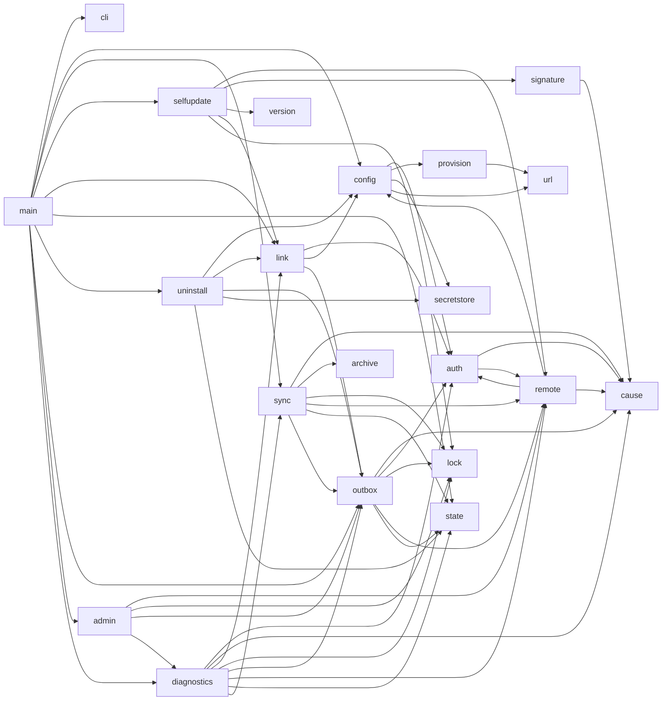

# Architecture

`brainmaker` is one Rust binary. It has no background process, no plugin
system, and no local database. The same binary carries the admin commands, which the admin runs on
an install like everyone else's. One invocation loads settings, gets one access token for each scope
that it needs, makes a bounded number of further HTTP requests, writes the filesystem, and exits.
A `sync` makes at most three requests for the content and the software, one for the operator name,
one for each note that is ready in the outbox, and one for the diagnostic report, at most once in
30 minutes. `uninstall` is the exception: it loads no settings and opens no socket.

A second binary, `brainmaker-sign`, lives in [`tools/sign.rs`](../tools/sign.rs). It builds only
under the `sign` feature and never ships.

## Components

| Module | Role | Depends on |
|---|---|---|
| [`src/main.rs`](../src/main.rs) | Entry point, command dispatch, all `stdout` output | every module |
| [`src/cli.rs`](../src/cli.rs) | Argument parsing, the check that each option applies to the command, and the help text | none |
| [`src/config.rs`](../src/config.rs) | Settings load, the import check, the root and every path under it (`Layout`), route and URL building, credential checks, size limits, hash validation | `auth`, `provision`, `secretstore`, `url` |
| [`src/auth.rs`](../src/auth.rs) | The OAuth2 client-credentials exchange, the bound on the token lifetime, the access token cache with one token per scope, and the `invalid_scope` error | `cause`, `config`, `remote`, `ureq` |
| [`src/url.rs`](../src/url.rs) | URL origin parsing, and the rule that a base URL must use TLS | none |
| [`src/provision.rs`](../src/provision.rs) | Provisioning file discovery, parsing, validation | `url` |
| [`src/secretstore.rs`](../src/secretstore.rs) | Seal and open the stored settings, report what binds them to the machine, restrict file modes | `ring` |
| [`src/remote.rs`](../src/remote.rs) | HTTP GET as text, streamed download to a file, the signed content release, the note upload, `whoami`, the upload of the diagnostic report, and the removal of control characters from server text | `auth`, `cause`, `config`, `digest`, `signature`, `ureq` |
| [`src/outbox.rs`](../src/outbox.rs) | The note rules and the word for each one, the checks of the upload path, push, the moves to `sent/` and `rejected/`, the counts, the report headers, and the operator file | `auth`, `cause`, `config`, `lock`, `remote`, `selfupdate`, `state` |
| [`src/diagnostics.rs`](../src/diagnostics.rs) | The run log, the state of the machine, the words that a report may hold, the checks of the upload path, and the send with its interval and its record | `auth`, `cause`, `config`, `link`, `lock`, `outbox`, `remote`, `schedule`, `selfupdate`, `state`, `sync` |
| [`src/cause.rs`](../src/cause.rs) | The cause of a failure as one word from a fixed list, carried by an error whose text does not change | `auth`, `ureq` |
| [`src/admin.rs`](../src/admin.rs) | The admin commands: `pull-outbox` with its frontmatter stamp and its no-replace write, the fleet view and the admin's shape of it, the merged sync log, and `diagnose` with its findings | `auth`, `cause`, `config`, `diagnostics`, `link`, `lock`, `outbox`, `remote`, `selfupdate`, `version` |
| [`src/sync.rs`](../src/sync.rs) | Version compare, install, directory swap | `archive`, `cause`, `config`, `digest`, `lock`, `outbox`, `remote`, `state` |
| [`src/archive.rs`](../src/archive.rs) | Zip extraction and its safety checks | `config`, `zip` |
| [`src/state.rs`](../src/state.rs) | `state.json` read and atomic write | `serde_json` |
| [`src/lock.rs`](../src/lock.rs) | The install lock and the update lock, which keep two runs out of one root | none |
| [`src/selfupdate.rs`](../src/selfupdate.rs) | Envelope and manifest parse, checksum, binary swap | `config`, `digest`, `link`, `lock`, `remote`, `signature`, `version` |
| [`src/signature.rs`](../src/signature.rs) | Ed25519 check of a manifest or a content release, and the two trusted key lists | `cause`, `ring` |
| [`src/digest.rs`](../src/digest.rs) | SHA-256 over a file, and the checked form of a digest string | `ring` |
| [`src/link.rs`](../src/link.rs) | Bridge the synced content into `~/.claude`, the outbox directory, the session context, the shell quoting of the hook command, the binary copy under the root, the role check that leaves the admin's Claude unconnected, and the read of which pieces of the bridge are there | `auth`, `config`, `outbox`, `schedule`, `serde_json` |
| [`src/schedule.rs`](../src/schedule.rs) | Write, load, unload, and remove the hourly macOS LaunchAgent | none |
| [`src/version.rs`](../src/version.rs) | Version string comparison and validation | none |
| [`src/uninstall.rs`](../src/uninstall.rs) | Remove the bridge, what `brainmaker` wrote under the root, and then the root. The outbox stays. | `config`, `link`, `outbox`, `schedule`, `secretstore`, `state` |

[`src/testutil.rs`](../src/testutil.rs) is built for tests alone; it holds a loopback HTTP server, a
signer whose key a test trusts, and a zip builder. The server records the headers and the body of
each request, sends response headers, gives a route a list of replies, and answers the token route
by the scope that the form asks for.

## Module graph


```mermaid
graph LR
    main --> cli
    main --> config
    main --> sync
    main --> selfupdate
    main --> link
    main --> state
    main --> uninstall
    main --> outbox
    main --> admin
    main --> diagnostics
    admin --> remote
    admin --> lock
    admin --> outbox
    admin --> diagnostics
    diagnostics --> auth
    diagnostics --> cause
    diagnostics --> link
    diagnostics --> lock
    diagnostics --> outbox
    diagnostics --> remote
    diagnostics --> state
    diagnostics --> sync
    remote --> cause
    auth --> cause
    sync --> cause
    signature --> cause
    outbox --> cause
    config --> auth
    config --> provision
    config --> secretstore
    config --> url
    provision --> url
    auth --> remote
    sync --> archive
    sync --> lock
    sync --> remote
    sync --> state
    sync --> outbox
    outbox --> auth
    outbox --> lock
    outbox --> remote
    outbox --> state
    selfupdate --> remote
    selfupdate --> signature
    selfupdate --> version
    selfupdate --> link
    selfupdate --> lock
    remote --> config
    remote --> auth
    link --> auth
    link --> config
    link --> outbox
    uninstall --> config
    uninstall --> link
    uninstall --> outbox
    uninstall --> secretstore
    uninstall --> state
```

## Boundaries

These boundaries separate the trusted code from data it does not control.

| Boundary | Crossed by | Enforced in |
|---|---|---|
| Network to disk | The content hash, the zip archive, the software manifest, the replacement binary | `signature::verify`, `config::validate_hash`, `archive::extract`, `version::validate`, `Build::checksum` |
| Network to disk | The operator name, and the month and the reason in the answer to a note | `outbox::update_operator`, which writes only a name that matches the operator rule; `received_month`, which gives `unknown` for any other shape; `remote::printable` |
| Disk to network | The notes in the outbox | `outbox::check` and `read_capped`: a regular file and no symbolic link, the name rule, the 64 KiB cap, UTF-8, the frontmatter rules, and 60 seconds with no change |
| Network to disk | The notes that `admin pull-outbox` writes | `admin::place`, which checks every value again and the SHA-256 of the text; `admin::stamp`; `admin::write_new`, which never replaces a file |
| Disk to network | The run log and the state of the machine, in the diagnostic report | `diagnostics::read_log`: a regular file and no symbolic link, each line parsed into an `Event` whose words come from fixed lists, and `Event::is_valid` on every value. `diagnostics::state` builds the state from typed values. No byte of a file goes into the report as it stands. |
| Network to the terminal | The diagnostics that `admin diagnose` prints | A typed parse that refuses a field or a word it does not know, and `admin::check_diagnostics` on the client ID, each time, each version, and each content hash |
| Network to a header | The access token | `auth::check_token`, which refuses a token that holds a control character |
| Provisioning file to store | The endpoints and the client credentials | `provision::parse`, `Settings::validate`, `provision::check_credential_set`, `url::check_base_url`, `Credentials::new` |
| Store to process | The sealed settings | `secretstore::open`, which authenticates the file before it returns bytes |

Only `remote.rs` and `auth.rs` open a socket, and both build the agent through `remote::build_agent`,
so one place sets the timeouts and the user agent. Only `secretstore.rs` holds key material. Only `url.rs` reads the
scheme, host, and port of a URL, so both base-URL checks cannot drift apart.
Only `main.rs` prints to `stdout`; every other module reports through `anyhow::Result` or through
the injected `log` closure.

## Data model

### On-disk layout

```text
~/.brainmaker/
├── agent.log           the LaunchAgent's output: a date line per run, and errors
├── bin/
│   └── brainmaker      0755, the copy that link writes and the hook and the agent run
├── confidential/       0700
│   └── config.enc      0600, the sealed endpoints, routes, and credentials
├── content/            the extracted content
├── diagnostics.json    {"last_attempt_at_unix": ..., "last_report_at_unix": ..., "sent_through": ...}
├── diagnostics.jsonl   the run log: one line for each thing that a run did
├── operator            the operator name that whoami gave, and one line feed
├── outbox/             0700, where Claude writes the end-of-session notes
│   ├── rejected/       each note that broke a rule, beside <name>.reason.txt
│   └── sent/<YYYY-MM>/ each note that the server holds, by the month it received it
├── push.json           {"last_push_at_unix": ..., "last_push_notes": ...}
├── .admin.lock         the lock that an admin command holds
├── .diagnostics.lock   the lock that sync holds while it sends the diagnostic report
├── .lock               the install lock that sync holds
├── .outbox.lock        the push lock that sync and push hold
├── .update.lock        the update lock that self-update holds
└── state.json          {"hash": "...", "updated_at_unix": ..., "sequence": ...}
```

`bin/brainmaker` appears only after `link` has run. `unlink` leaves it in place, because removing
the file a running hook names would break a session that is already open. `uninstall` removes it,
together with everything else in this tree that `brainmaker` wrote.

`brainmaker` also creates `.staging/`, `.trash/`, and `.download.zip` under the root while it
works, and removes all three before it exits, on success and on failure alike. `content/` is
replaced on every update, so keep your own files elsewhere. `sync` holds an exclusive lock on
`.lock` while it installs, and `self-update` holds one on `.update.lock` while it replaces the
program. Both files stay in the root between runs, and `uninstall` removes them.

`operator` and `push.json` are written through a temporary file, `operator.tmp` and `push.json.tmp`,
and a rename. `push.json` is the only file that push writes besides the notes it moves: push never
writes `state.json`, whose only writer is `sync` under `.lock`.

`diagnostics.json` is written the same way, through `diagnostics.json.tmp`. `diagnostics.jsonl`
grows by one append for each run, and a cut writes its newest part through `diagnostics.jsonl.tmp`
and a rename.

`self-update` writes `.brainmaker-probe-<pid>`, `.brainmaker-update-<pid>`, and `.brainmaker-old`
beside the binary, and removes them before it exits. On Windows the last two carry the `.exe`
suffix. A run that is killed cannot remove its files, so the next `self-update` removes every
`.brainmaker-probe-*` and `.brainmaker-update-*` file in that directory once it holds the update
lock. It leaves every other file there as it is.

### `state.json`

| Field | Type | Meaning |
|---|---|---|
| `hash` | string | Hash of the archive that produced the current `content/` |
| `updated_at_unix` | integer | Seconds since the Unix epoch at the last successful install |
| `sequence` | integer | The sequence of the installed release. The file leaves this field out when the release carried none. A reinstall of the installed hash keeps the higher value. |

A missing or corrupt file reads as `None`, which the caller treats as "not installed". That is not
an error: the reinstall repairs the state.

### `push.json`

| Field | Type | Meaning |
|---|---|---|
| `last_push_at_unix` | integer | Seconds since the Unix epoch at the end of the last push that sent a note |
| `last_push_notes` | integer | How many notes that push sent |

A missing or corrupt file reads as no push. `status` prints the age of the push on its `pushed`
line.

### `diagnostics.jsonl`

The run log. Each line is one JSON object: one thing that one run of `sync`, `push`, `self-update`,
`link`, or `unlink` did.

| Field | Type | Meaning |
|---|---|---|
| `id` | string | 16 hexadecimal characters, drawn at random. The server stores a line once. |
| `at_unix` | integer | Seconds since the Unix epoch when the line was written |
| `command` | word | The command that ran |
| `code` | word | What it did, such as `content.updated` or `push.rejected` |
| `cause`, `rule` | word | Left out unless the line names the cause of a failure, or the rule that a note broke |
| `status`, `count` | integer | Left out unless the line names an HTTP status, or a number of notes |
| `hash`, `version` | string | Left out unless the line names a content hash, or a version of the program |

[API.md](API.md#the-diagnostic-report) lists every word. The file stays under 256 KiB: a run that
takes it past that size cuts it to its newest 128 KiB. A line that is not of this shape is never
sent.

### `diagnostics.json`

| Field | Type | Meaning |
|---|---|---|
| `last_attempt_at_unix` | integer | Seconds since the Unix epoch at the last try to send a report. A `link` or an `unlink` that worked moves it back, so that the next report is due 90 seconds later. |
| `last_report_at_unix` | integer | The same for the last report that the server stored. The file leaves it out until one is stored. |
| `sent_through` | string | The `id` of the newest line of the run log that the server holds |

A missing or corrupt file reads as no report, so the next `sync` sends one. `status` prints the age
of the last stored report on its `reported` line.

### `config.enc`

| Offset | Bytes | Content |
|---|---|---|
| 0 | 5 | The magic `BMKR1`, which also serves as the AEAD additional authenticated data |
| 5 | 12 | The random nonce |
| 17 | rest | AES-256-GCM ciphertext and tag over the `KEY=VALUE` text |

### Settings source

`Config::load` records where this run's settings came from, and `status` prints it.

| Source | Meaning |
|---|---|
| `Imported` | A provisioning file was found and imported during this run |
| `Stored` | The sealed store held the settings |
| `Environment` | The environment supplied the base URL, and no store was needed |

The ten routes live in the same store, and the environment overrides one route at a time.

## Decisions and tradeoffs

### No endpoint is compiled into the binary

Every URL arrives in a provisioning file. The test
`config::tests::no_endpoint_is_compiled_into_this_module` reads `config.rs` at compile time and
fails when a scheme is followed by a host character outside the test module.
`auth::tests::no_endpoint_is_compiled_into_this_module` does the same for `auth.rs`, and
`cli::tests::the_help_text_names_no_endpoint` does the same for the help text.

The tradeoff: a fresh binary cannot do anything on its own, and the first run must find a file.

### The manifest is signed, and the signature covers the served bytes

The trust anchor for `self-update` is an Ed25519 signature, not the TLS connection. The route
returns an envelope whose `payload` field is the manifest as a JSON string, and whose `signature`
field covers exactly those bytes.

Carrying the manifest as a string, rather than as a nested object, keeps JSON canonicalisation out
of the security argument: the client verifies bytes, then parses them. One route rather than a
sibling `.sig` route means one upload, so no client can fetch a new manifest with an old signature.
Hexadecimal rather than base64 avoids a new dependency.

The tradeoffs: the route body is no longer readable at a glance with `curl`, and any proxy that
reformats the JSON breaks every client.

### The public key is committed, the private key is not

`PUBLIC_KEYS` in [`src/signature.rs`](../src/signature.rs) holds the keys this binary trusts. The
key is public, so unlike `BRAINMAKER_CONFIG_KEY` it lives in the repository, and rotating it is a
code change plus a release. The list holds more than one key so that a rotation does not break
clients that have not updated yet.

The tradeoff: a build whose list is empty refuses every manifest. That fails closed, and it makes
`self-update` inert until an operator generates a key. The release workflow fails rather than ship
such a binary.

### A base URL must use TLS, unless it names this machine

`brainmaker` sends the client secret to the token endpoint and the bearer token on every API
request, so `url::check_base_url` requires `https://`. It allows `http://` only when the host is
`localhost` or a loopback address, because the credential then never reaches the network. The rule
covers `BRAINMAKER_API_BASE`, `SWETSI_JWT_ENDPOINT`, and `--url`, so
`--url http://localhost:8080` still works for a local test server.

The tradeoff: a staging server on plain HTTP and a routable address no longer works, and an
operator must give it a certificate or run it on the loopback interface.

### The client holds a client secret, not a bearer token

The provisioning file carries a client identifier and a client secret. `auth::bearer` exchanges them
for an access token at `POST {jwt_endpoint}/oauth2/token`, and the server expires that token after
10 minutes. A static token, which earlier versions carried, stayed valid until an operator revoked
it by hand.

The client takes the lifetime from `expires_in`, and cuts it to one hour. That value arrives from
the network and is added to a clock reading, and the release profile sets `panic = "abort"`, so an
unbounded sum could stop the process. A sum that the clock still cannot hold caches nothing.

The token lives in `TokenCache`, which one `Config` owns. The cache holds one token per scope, so one
run fetches one `sync` token and reuses it for every read, and fetches an `outbox:write` token only
when a note is ready to send. The cache never reaches the disk, so nothing on disk holds a usable
bearer token between runs. The client stops using a token 30 seconds before it expires, so a request
that starts near the boundary does not arrive with an expired token.

Each token request names one scope. A sync token therefore never carries the right to write a note,
and an issuer client without `outbox:write` still syncs: the issuer answers `invalid_scope`, which
`auth::InvalidScope` carries, and only the push stops.

The tradeoffs: every run costs one extra HTTP request, the server must serve a token endpoint, and a
provisioning file now carries three credential keys rather than one. `provision::check_credential_set`
therefore requires all three or none, so a half-configured file fails at load rather than at the
first HTTP 401.

### The admin commands live in the same binary

`brainmaker admin pull-outbox`, `admin status`, `admin syncs`, and `admin diagnose` are commands of
this binary, not of a second one. The crate has no library target, so a second binary would have to include `config`,
`auth`, `remote`, and more by path. The server enforces what a token may read, so the commands grant
nothing by themselves. The admin's credential holds `sync` and `outbox:read`: `sync` lets it run
`self-update`, and `outbox:read` lets it read the notes and the fleet.

### `link` asks the issuer for the role

The admin installs from a package into `~/.brainmaker`, like everyone else, and the installer runs
`link`. The bridge would put the operator briefing in front of the admin's Claude, so `link` first
asks the issuer for an `outbox:read` token and, when it gets one, for an `outbox:write` token. A
credential that reads the outbox and cannot send notes is the admin's: `link` connects nothing to
Claude, removes any piece of the bridge that an earlier run wrote, and writes an agent that runs
`self-update` alone. Every other credential gets the bridge, one with both scopes included.

The issuer is the only authority on the role, so a new admin needs no new client code and no marker
on the disk. A check that gets no clear answer, such as a timeout, stops `link` before it writes
anything: a guess could connect the admin's Claude. Before this check, the admin's copy had a root
of its own and a manual install, and "never run `link` there" was a sentence in the documents.

The tradeoffs: `link` now needs the issuer, where it needed no network before, and an operator's
`link` asks for one token that the issuer refuses. The installer runs `sync` just before `link`, so
the issuer is reachable at that moment anyway.

`pull-outbox` never replaces a file, and it acknowledges only the notes that are on disk. It always
writes `author` and `review_flags` from the server's values, so the operator can neither choose the
name on a note nor clear a flag. A note that cannot be written stays on the server for the next run.

The admin commands print the client IDs that the server reports. That is the one exception to the
rule against printing a client identifier, and the credential of the machine that runs them is
never printed.

The tradeoff: every laptop carries code that only the admin runs. It is small, and it does nothing
without a credential that holds `outbox:read`.

### Push runs inside `sync`, after the content step

Only `link` writes the hook and the LaunchAgent, and a linked Mac never runs `link` again. So push
is code inside `sync`, in [`src/outbox.rs`](../src/outbox.rs), and it reaches every linked Mac with
the next `self-update`, within an hour, with no second `link`. `sync` also creates `outbox/` with
mode `0700` when it is missing, for the same reason.

`main.rs` keeps the result of the content step, runs the outbox steps, and then returns that result.
The outbox steps are `whoami`, then push, and they run only when this run received a `sync` token,
which proves that the issuer answered. A failed content step does not stop them, because the server
that has no content to serve can still take a note. Each of their failures is a notice. Push makes
no request at all when no note is ready.

The tradeoffs: the `SessionStart` hook gives `sync` 60 seconds, and push shares them. A run that the
timeout stops loses nothing: the server answers a note that it already holds as a duplicate, and the
next run moves the file to `sent/`.

### Push has its own lock and its own record

Push holds `.outbox.lock` without waiting, and a run that finds it held sends nothing. It records its
last success in `push.json`, never in `state.json`. `sync` is the only writer of `state.json`, under
`.lock`, and a second writer under another lock could lose an update.

### The upload path is a trust boundary

Push is the first path from the disk to the network. A symbolic link in the outbox could otherwise
send any file that the user can read, so push reads the entry with `symlink_metadata`, refuses a link
and anything that is not a regular file, and checks that the file it opens is the file it checked. It
then applies the name rule, the 64 KiB cap, UTF-8, and the frontmatter rules that the server applies.
A file that changed in the last 60 seconds waits, so a note that Claude is still writing never
leaves half written.

A file that fails a check moves to `rejected/` with its reason, and a name that is taken there gets a
number. A link moves as a link, and the file it names stays where it is.

### The client reports its own state, and the server asks for nothing

Two operators synced on every run and sent no note, and the server could not say why. Each cause
was on the machine: the program was too old, `link` never connected Claude, every note broke a
rule, or no note was written. The admin had to ask each operator for the output of `status` and
`push`.

So the client sends a diagnostic report: its state, and the new lines of a run log that it keeps
under the root. It rides on `sync`, as push does, for the same reason: a linked machine never runs
`link` again, and code inside `sync` reaches it with the next `self-update`.

The client decides what the report holds. The server has no route that asks for one, and nothing
in its answer changes what this program does: the client reads the status of the answer and no
field of its body. The interval, the size, and the content are constants of this binary. A server
that could ask a client for data, or name what a client runs, would be a way to run commands on
every laptop, and this design has none.

The report goes with the `sync` token that the run already holds. A scope of its own would need a
change at the issuer for every client, and the client that an admin most needs to see is the one
whose issuer settings are wrong. The cost is small: a `sync` token can now write a bounded report
about its own client, which the admin alone reads.

`sync` sends the report after the outbox steps, at most once in 30 minutes, and only when the run
received a `sync` token. A report that fails prints nothing and changes no exit code. It takes
`.diagnostics.lock` without waiting, and it has 10 seconds in all, because it shares the 60 seconds
of the `SessionStart` hook.

The installer runs `sync` and then `link`, so the first report of a machine says that the hook is
absent. A `link` or an `unlink` that worked therefore cuts the wait for the next report to 90
seconds. The wait is not zero: on macOS, `link` loads the hourly agent, which runs `sync` at once,
and the server refuses a second report of one client inside a minute.

The tradeoffs: the admin sees a machine as it was at its last report, not as it is now, and a
client older than the report sends none. `admin diagnose` then falls back on what the server saw:
the version in the `User-Agent` of the last sync.

### A report holds words and numbers, and never text

A log line is the natural home of an error message, and an error message of this program can name
a URL, a path, and words that a server chose. The reason beside a rejected note quotes the note.
None of that may leave the machine.

So no field of a report holds free text. A value is a word from a fixed list, a bounded number, a
content hash of 8 hexadecimal characters, or a version of digits and dots. A step that failed is
named by a `Code` and a `Cause`, and a note that was refused by a `Rule`. The types make it so: an
`Event` holds enums, and its two strings pass a rule before they enter it.

The few places that know the cause of a failure say it twice. [`src/cause.rs`](../src/cause.rs)
gives them an error that prints the same text as before and carries the word, and `cause::of`
reads the word back through any context. An error that no place marked reads as `other`.

The run log is a file, and a file can be replaced, as a note can. The report never sends its
bytes. `diagnostics::read_log` refuses a symbolic link, parses each line into an `Event`, and
checks every value, and the report is written from the events that passed. A line that someone
else wrote into the file, with whatever text, is not sent.

The tradeoff: the admin reads `content.unreachable  http  HTTP 503`, and not the sentence that the
operator would see. The words were chosen to tell the causes apart, and a new cause needs a new
word on both sides.

### `diagnose` names the cause

`admin diagnose` joins two sources: the fleet view, which holds what the server saw of a client,
and the diagnostics that the client sent. `admin::findings` turns them into sentences: the hook is
absent, every note broke a rule, no note was written, the client is too old. The command prints
the values too, so the admin can check each sentence against them.

The diagnostics have a route of their own. The fleet view and the sync log keep their shape,
because the admin commands of an earlier version refuse a field that they do not know.

### The server names the operator

The name on a note comes from the server, from the credential that sent it: nothing in the note, its
file name, or a header names the operator. `sync` asks `whoami` with its `sync` token and writes the
answer to `operator`, so a correction on the server reaches every machine at its next sync with no
new package. An answer of `null` deletes the file, and a failure leaves it as it is.

The file is a convenience for Claude, never a security control. `session-context` reads it, and a
file that someone edited into another shape reads as no name.

### One parser reads every URL origin

`url::parse` returns the scheme, the host, and the port, and fills the port in from the scheme.
`url::check_base_url` uses it for both base URLs, so the TLS rule reads a parsed origin rather than
a string prefix. Filling in the port means `https://host` and `https://host:443` compare equal.

The tradeoff: `brainmaker` carries a small URL parser rather than a dependency. It handles only the
`http` and `https` schemes and rejects everything else.

### No URL leaves this repository, in either direction

The binary compiles in no endpoint, and the release publishes none. The manifest carries a version
and one SHA-256 per platform, and the client derives the download address from its own base URL and
`BRAINMAKER_SOFTWARE_BINARY_PATH`. The route names are configurable too, so a deployment that sets
all ten route keys keeps its whole URL layout out of this repository, out of the workflow logs, out
of the release notes, and out of the release assets.

This also removes a check rather than adding one. An earlier design put a `url` in each manifest
entry and compared its origin against the base URL. A derived URL cannot name another host at all,
so the comparison has nothing left to reject.

The tradeoffs: the served file names must match the configured route, and moving the binaries to a
different path means issuing a new provisioning file rather than editing one manifest.

### The content key and the software key are two separate lists

`PUBLIC_KEYS` verifies a software manifest. `CONTENT_KEYS` verifies a content release. Both live in
[`src/signature.rs`](../src/signature.rs), and both are checked by the same `verify_with`.

They are separate because they protect different things and are held by different people. The
software key signs what replaces the running executable, so it stays off every server and reaches
CI only as a repository secret. The content key signs what lands in `content/`, which changes
whenever the shared vault does, so whoever publishes content must hold it: a deploy host, in
practice.

One list would collapse those into a single capability: the machine that publishes a note could
sign a manifest and replace every binary in the fleet. A unit test fails the build if a key ever
appears in both lists, and the release workflow reads each block on its own so that a manifest
signed with the content key cannot pass the manifest check.

The tradeoff: two keys to generate, two to rotate, and two ways for a build to be inert. A build
with an empty `PUBLIC_KEYS` installs no update; one with an empty `CONTENT_KEYS` installs no
content. Both fail closed, and `brainmaker status` prints each count.

### The content archive is checked before it is extracted

`sync` reads `content/latest` as the envelope the software manifest already uses, verifies the
signature over the served bytes, and takes the hash from the signed payload rather than from the
unsigned field beside it. A server therefore cannot point a client at one archive while signing
another.

After the download, the size and the SHA-256 are compared against the signed values before
`archive::extract` opens the file. The extractor's own rules (no escaping path, no symbolic link,
a cap per entry and per archive) still apply, but they now guard content that a trusted key
already vouched for rather than content that only TLS vouched for.

This matters more than it would for inert data. The content ships a `.claude` directory whose
hooks `link` registers, so an archive that reached a machine unchecked would be code that runs at
every session start.

### A content release must be newer than the one installed

A signature proves who made a release, and not when. Without an order, a server could serve any
release that was ever signed, and every client would install it. The signed payload therefore
carries a `sequence`, which `brainmaker-sign` sets to the time of signing unless the operator names
one, and `state.json` records the sequence of the installed release.

`sync::check_order` passes when no sequence is installed or when the offered one is higher. It
fails for an equal, a lower, or a missing sequence. It applies only when the offered hash differs
from the installed one, so a missing `content/` is restored whatever the sequence. It runs twice:
once before the install lock, and again on the state read after the lock, so a run that waited
cannot replace a release that another run installed during the wait with an older one. A
reinstall of the installed hash records the higher of the two sequences.

`--force` skips the rule, for a deliberate rollback on one machine, and records the older sequence.

The tradeoffs: a `state.json` written before this rule holds no sequence, so that machine accepts
any signed release until it installs one that carries a sequence. To roll every client back, sign
the older archive again: the new signature carries a new, higher sequence.

### An unreachable server is a notice, not a failure, while content is installed

`sync` runs from the `SessionStart` hook at the start of every Claude session, and a laptop is
often offline. When `remote::latest_release` fails and `state.json` names a hash whose `content/`
is a directory, `sync` returns `Outcome::Unreachable` instead of the error. `main.rs` prints two
`notice:` lines to stderr and exits 0, so the session starts with the content it already had.

The exceptions keep the fallback honest. With nothing installed there is nothing to fall back on,
and `--force` asks for a download, so both return the error and exit 1.

`status` takes the same view for a different reason: it changes nothing, so an unreachable server
is a value to print rather than a reason to exit. It prints `latest    <unknown>` and
`state     cannot check: <reason>`.

The tradeoff: a machine that cannot reach the server for weeks reports success every session, and
only the stderr notice says the content is not fresh. `--quiet`, which the hook passes, hides it.

### The working directory is searched for a provisioning file on the first run only

`provision::find` takes a `provisioned` flag, which `Config::load` sets from whether `config.enc`
already exists. While it is true, step 4 of the search is skipped entirely.

The hook runs `sync` inside whatever project the user has open. Without this rule, a
`brainmaker.env` committed to some unrelated repository would be imported over the sealed
settings, and then deleted, on the first session opened in that directory. Steps 1 to 3 still run,
so `--config`, `$BRAINMAKER_CONFIG`, and a file beside the binary can still change the endpoints
later.

The tradeoff: dropping a file into the working directory works once and then stops working, which
is surprising if you do not know the rule.

### The hook runs a copy under the root, and `self-update` replaces that copy too

Nothing puts `brainmaker` on `PATH`, and the install instructions tell the reader to delete the
unpacked archive. So `link` copies the running binary to `<root>/bin/brainmaker` and writes that
full path, quoted, into the hook, along with `--dir <root>`.

The hook and the LaunchAgent both hand that command to a shell, so `link::command_prefix` writes
each path as one double-quoted word, with a backslash before `$`, the backtick, `"`, and `\`. Every
other character stays as it is, so a decomposed accent reaches the shell as its bytes. A path that
holds a control character is refused, because no quoting carries a line break through both a shell
and a property list.

That creates a second copy, and a `self-update` that reached only the file the user happened to
run would leave every session on the old version. So `selfupdate::apply` replaces the installed
copy as well, whenever it is a different file from the one that ran.

"Different file" is decided by `link::same_file`, which canonicalises both paths, not by comparing
the two strings. A string comparison deleted the installed binary when `link` ran through a
symbolic link to it: the paths differed, the removal succeeded, and the copy then failed with
`No such file or directory`.

The copy itself lands beside the target under a temporary name and is renamed over it. Writing
into a file that is being executed fails with `ETXTBSY` on some systems, and a rename leaves a
running old copy holding its own inode.

The tradeoff: two copies of the binary exist, and a `self-update` run from a third location
updates both of them rather than one.

### An hourly LaunchAgent installs signed builds without a person

The `SessionStart` hook only syncs, and it never installs a binary, so a Mac stayed on its version
until someone ran `self-update`, and a Mac that started no session kept old content. On macOS,
`link` therefore also writes a LaunchAgent that runs `self-update` and then `sync` through
`/bin/sh` at minute 0 of every hour and at each login. `;` joins the two, so a failed update never
holds the content back. The agent runs the same copy under the root that the hook runs. The admin's
agent runs `self-update` alone, because no Claude on that Mac reads the content.

The agent is part of the bridge. `link` writes it, and `unlink` and `uninstall` remove it before
the program copy goes, so no hourly run starts a file that is gone. The installer already runs
`link` and has no step of its own for the agent.

It belongs to the account, as `~/.claude` does. `--claude-dir` names another Claude directory,
which is a test or a second setup, so `Agents::resolve` then returns no agent unless
`--agent-dir` names where it goes, and an agent in a named directory is never loaded. Without this
rule, the installer's dry run would leave a real agent that synced a throwaway root every hour.

A `launchctl` failure is a notice, not an error: the property list is in place, and launchd loads
it at the next login. An SSH session, which has no GUI domain, is the usual cause.

The tradeoff: a promoted build reaches every linked Mac within an hour, with no person to stop
it. The five `self-update` controls are the only gate, so the signing key decides what every Mac
runs. Only macOS has launchd; Windows and Linux keep the hook as their only trigger.

### Claude files are replaced whole, or not at all

`link` and `unlink` edit two files that belong to the user: `~/.claude/settings.json` and
`~/.claude/CLAUDE.md`. A partial write there would lose the user's own hooks or text. So each file
is written to a temporary file beside it and renamed over it, and the mode of an existing file is
kept. When the path is a symbolic link, the file it names is replaced and the link stays.

A file that exists but cannot be read as text stops the run, because treating it as empty would
replace text that was never read. `CLAUDE.md` must hold no marker, or one start marker followed by
one end marker. Any other shape stops the run, because a guess at which markers belong together
would delete the user's text. In `settings.json`, `unlink` removes single hook entries whose
command ends with `# brainmaker-link`, and removes a group only when that removal emptied it.
`serde_json` is built with `preserve_order`, so the file keeps the key order the user wrote.

The tradeoff: a damaged marker pair needs a manual fix before `link` or `unlink` runs again.

### The parser refuses an option that has no effect

`cli::check_options` holds one row per option, with the commands it applies to. An option given
with another command fails the run, for example `sync --check`. A value option given twice fails,
and so does a value that starts with a hyphen, so `uninstall --dir --yes` no longer takes `--yes`
as the root. An option that was accepted and ignored let the user believe it took effect.

The tradeoff: a script that passed a harmless extra option now fails, and must drop it.

### A relative `--dir` becomes absolute before anything is written

`Config::load` passes `--dir` through `std::path::absolute`. Every path derived from the root
outlives the working directory: the skill symbolic links under `~/.claude/skills`, the hook
command, and the `--dir` inside it. A relative root would put a relative path into all three, and
each would then resolve against whatever directory the next session happened to start in.

### `uninstall` reads no settings

Every other command runs `Config::load` first. `uninstall` builds a `Layout` from `--dir` alone,
because it must work where the sealed store no longer opens, for example after a switch between a
release build and a local one, whose compiled-in keys differ. Loading settings could also import a
provisioning file, which would write a store only for `uninstall` to remove it. The parser therefore
refuses `--config`, `--keep-config`, and `--url` with `uninstall`, rather than accept flags that
would do nothing.

`Layout` is the part of `Config` that names the root and the paths under it. `Config` answers each
of its path methods through its `Layout`, so the two cannot disagree on where a file lives.

The tradeoff: `uninstall` holds no credential, so it cannot revoke the client on the server. The
client stays valid until an administrator revokes it.

It also leaves `outbox/`, with every note in it, sent or not, and prints how many notes were never
sent. A note is the operator's work, and one that was never sent exists nowhere else. The root then
stays too.

### `uninstall` removes only a recognised root, one entry at a time

A root is recognised when it holds a `state.json` that parses as the state `sync` writes, or a
`confidential/config.enc` that starts with the sealed header. `uninstall` then removes the paths
that `brainmaker` writes, by name, and removes `bin/`, `confidential/`, and the root only when each
one is empty. A file of yours under the root survives, and so does every directory that holds it.
A symbolic link goes, and the target it names stays; a root that is itself a link loses the link.

A root that exists but is not recognised stops the run before anything changes, the bridge in
`~/.claude` included. `link` marks the hook and the `CLAUDE.md` block with `brainmaker-link`, not
with the root they serve, so removing them on behalf of a wrong `--dir` would cut off a real install
elsewhere. A root that does not exist carries no such risk, and the bridge still goes.

The two marks go last. A run that stops part-way keeps them, so the next run still recognises the
root and finishes.

The tradeoff: a root whose `state.json` is corrupt and whose store is missing is not recognised,
and you remove it by hand.

### The stored settings are bound to the machine

The file key is HKDF-SHA256 over a secret compiled in at build time, salted with a machine
identifier. A copy of `config.enc` therefore does not open on another machine.

When the system gives no identifier, `secretstore::machine_identity` falls back to the home
directory path, and then to a constant, and returns a `Binding` that names which one it used.
`status` prints it on its `binding` line, and an import on a weak binding logs a warning. The three
identity strings are part of the key, so a change to one makes every stored file unreadable.

The tradeoff: rotating `BRAINMAKER_CONFIG_KEY` makes every existing store unreadable, and every
employee has to import a fresh file. See [SECURITY.md](SECURITY.md) for what this does and does not
protect against.

### The swap is two renames, not a copy

`sync::swap` renames `content/` to `.trash/`, then renames `.staging/` to `content/`. The window in
which `content/` does not exist is one rename long. A failure on the second rename restores the old
directory.

The tradeoff: `.staging` must sit on the same filesystem as `content/`, which is why both live
under the same root.

### One install at a time, and a busy root is a notice

The `SessionStart` hook and the hourly LaunchAgent both run `sync`, and nothing orders them. Several
Claude sessions can also start together. Every run uses the same `.staging/`, `.trash/`, and
`.download.zip`, and clears them before and after its own install. Without a lock, a second run
deletes the `.staging/` that the first run is still filling. The first run then swaps a partial
directory into `content/` and writes the release hash to `state.json`, and every later `sync`
reports that content as up to date.

`sync` therefore takes an exclusive lock on `.lock` before it downloads, and holds it until the
install ends. `self-update` takes a second lock, on `.update.lock`, while it replaces the program.
The two are separate files, so a long content download does not delay a software update, and the
reverse. Push takes a third, `.outbox.lock`, and does not wait for it. The diagnostic report takes
a fourth, `.diagnostics.lock`, in the same way. The operating system drops a lock when its process
ends, including when the process is killed, so no stale lock remains.

A run that finds the lock held waits up to 30 seconds. When the holder installed the release in that
time, `sync` reads `state.json` again and reports the content as up to date. When the lock is still
held after 30 seconds, and content is installed, `sync` returns `Outcome::Busy`. `main.rs` prints
two `notice:` lines to stderr and exits 0, as it does for an unreachable server, and `--quiet`
hides them. With nothing installed, or with `--force`, `sync` exits 1, because there is nothing to
fall back on. A `self-update` that finds its lock held for 30 seconds exits 1.

`sync` also restores content that a killed run stranded. A run that stops between the two renames of
the swap leaves the old content in `.trash/` and no `content/`. When `sync` starts and finds
`content/` missing and `.trash/` present, it takes the lock without waiting and renames `.trash/` to
`content/`. If another run holds the lock, that run may be inside its own swap, so `sync` leaves
`.trash/` alone.

The lock is `File::try_lock` from the standard library, which is stable since Rust 1.89, so
`Cargo.toml` declares `rust-version = "1.89"`.

The tradeoff: a run that finds the lock held for 30 seconds installs nothing, so the update arrives
with the next run. The lock is advisory. It orders `brainmaker` runs only, and `uninstall` takes no
lock.

### `state.json` is written after the swap

A hash in `state.json` therefore always describes the content on disk. A crash before the write
leaves a stale hash, which causes one extra download on the next run rather than a wrong claim.

### A pre-release suffix never triggers an update

`version::is_newer` compares only the dotted numeric core and ignores everything from the first `-`
or `+`. Two versions with the same core never trigger an update, whichever suffixes they carry.
That rule cannot start an update loop and cannot install an older build.

The tradeoff: `0.2.0-rc1` and `0.2.0` are indistinguishable to the client.

### The release profile trades build time for start time

`Cargo.toml` sets `lto = true`, `codegen-units = 1`, `strip = true`, and `panic = "abort"`, because
the binary runs at the start of every Claude session.

The tradeoff: a release build is slower to produce, and a panic gives no unwind or backtrace.

### Linux builds link against musl

Both Linux targets are `*-unknown-linux-musl` and link statically, so one binary runs on any
distribution of that architecture and has no glibc version floor. `ring` compiles C, so the
workflow names `musl-gcc` explicitly for both targets rather than relying on the `cc-rs` guess.

### The dependency set stays small

`ring` computes SHA-256 as well as the AEAD, HKDF, and Ed25519 operations, so no separate hash
crate is needed. The home directory comes from `std::env::home_dir`. `zip` builds with the
`deflate-flate2-zlib-rs` feature alone, which reads deflate and does not build the zopfli
compressor. HTTP Basic needs one base64 encoding, which `auth::base64` carries in about 20 lines.

The tradeoff: a few small functions live in this crate rather than in a dependency, and their
tests live here too.
