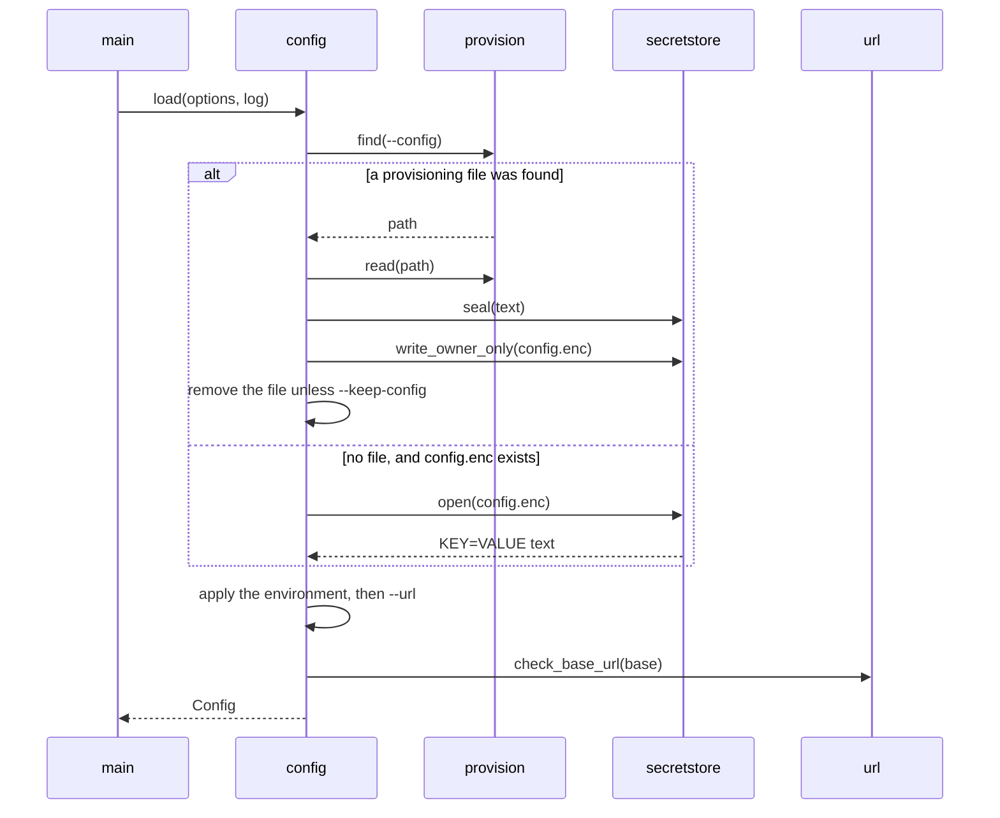
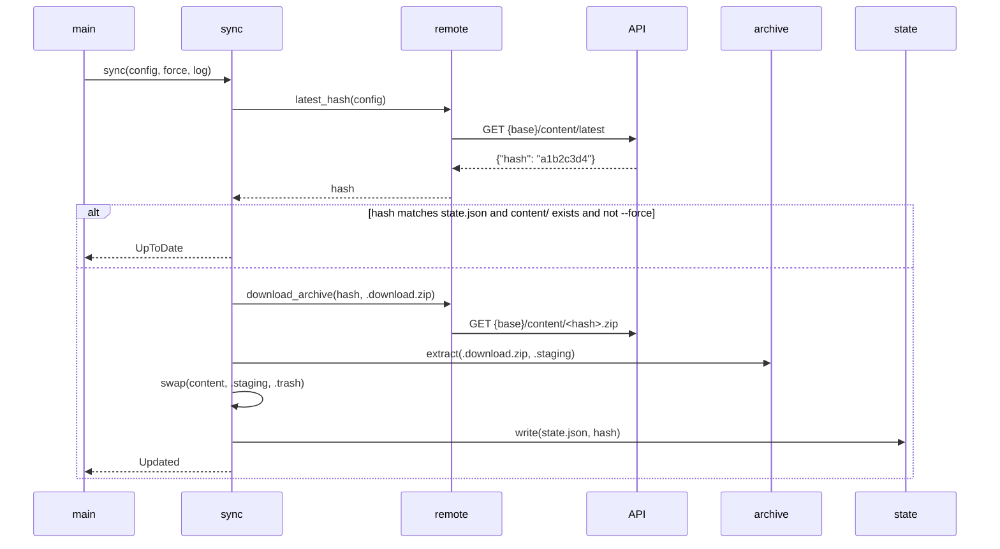
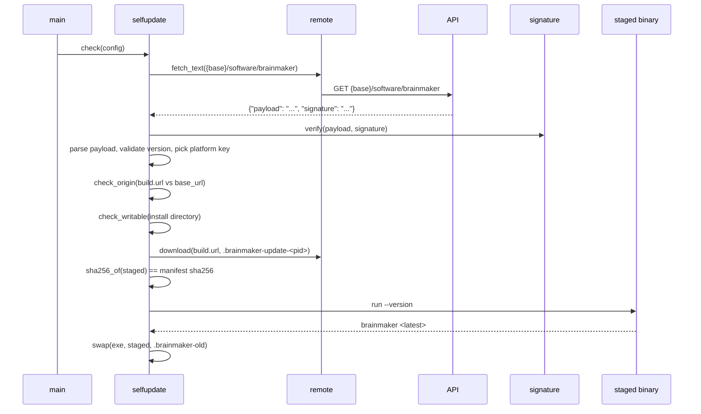

# Flow

Three runtime paths matter: loading the settings, the `sync` command, and the `self-update`
command. `status` reuses the first path and then reads both remote endpoints without writing
anything.

## Settings load

Every command starts here. `Config::load` runs before the dispatch in
[`src/main.rs:85`](../src/main.rs).

Steps:

1. [`config.rs:85`](../src/config.rs) resolves the root: `--dir`, else `~/.brainmaker`.
2. [`provision.rs:163`](../src/provision.rs) searches four locations in order and returns the first
   hit. A `--config` or `$BRAINMAKER_CONFIG` path that is not a file fails the run.
3. On a hit, [`config.rs:98`](../src/config.rs) seals the parsed settings and writes
   `confidential/config.enc` with mode `0600` inside a `0700` directory.
4. [`config.rs:107`](../src/config.rs) removes the plain file. A failed removal logs a warning and
   the run continues, because the settings are already stored.
5. With no hit and an existing store, [`config.rs:135`](../src/config.rs) decrypts it. A store from
   another machine or another build fails here with a message that tells you to reimport.
6. [`config.rs:144`](../src/config.rs) lets `SWETSI_API_BASE` and `SWETSI_TOKEN` override the
   stored values, then `--url` overrides both.
7. [`config.rs:156`](../src/config.rs) fails when no source supplied a base URL.
8. [`config.rs:171`](../src/config.rs) fails when the base URL is not `https://`, unless its host is
   this machine.

## Sync

Steps:

1. [`sync.rs:32`](../src/sync.rs) creates the root directory.
2. [`sync.rs:39`](../src/sync.rs) reads the latest hash. `remote::latest_hash` runs
   `config::validate_hash` on the response, so an out-of-range value fails before it reaches a URL
   or a path.
3. [`sync.rs:44`](../src/sync.rs) returns `UpToDate` when the local hash matches, `content/` is a
   directory, and `--force` was not given. No archive is downloaded.
4. [`sync.rs:70`](../src/sync.rs) clears `.staging`, `.trash`, and `.download.zip` left by a run
   that failed between steps.
5. [`sync.rs:75`](../src/sync.rs) streams the archive to `.download.zip`, stopping at 512 MiB.
6. [`sync.rs:78`](../src/sync.rs) extracts to `.staging`. Rejected entries are counted, not fatal;
   the log line reads `Skipped N unsafe archive entries.`
7. [`sync.rs:90`](../src/sync.rs) swaps the directories.
8. [`sync.rs:95`](../src/sync.rs) removes the three temporary paths, on success and on failure
   alike.
9. [`sync.rs:101`](../src/sync.rs) writes `state.json`, only after the swap succeeded.
10. [`main.rs:93`](../src/main.rs) runs the software check unless `--no-update-check` was given.

### The swap and its rollback

[`sync.rs:112`](../src/sync.rs):

1. Rename `content/` to `.trash/`, when `content/` exists.
2. Rename `.staging/` to `content/`.
3. If step 2 fails and step 1 ran, rename `.trash/` back to `content/` and return the error.

### Failure paths in sync

| Failure | Result |
|---|---|
| The response is not `{"hash": "..."}` | The run fails; nothing on disk changed |
| The hash is not 8 ASCII alphanumeric characters | The run fails before any URL is built |
| The download body exceeds 512 MiB or is empty | The partial file is deleted and the run fails |
| The archive is not a zip | The run fails; `content/` is untouched |
| One entry expands past 256 MiB, or the archive past 1 GiB | The run fails; `content/` is untouched |
| The second rename fails | The previous `content/` is restored, then the run fails |
| `state.json` cannot be written | The content is installed, and the run fails with that stated |
| The software check fails, including on a bad signature | A `notice:` line goes to stderr and the exit code stays 0 |

## Self-update

Steps:

1. [`selfupdate.rs:115`](../src/selfupdate.rs) reads the envelope, stopping at 1 MiB.
2. [`selfupdate.rs:124`](../src/selfupdate.rs) checks the Ed25519 signature over the `payload`
   bytes, against the keys in `signature::PUBLIC_KEYS`. A manifest that no key accepts stops here,
   so nothing below ever sees it. A build with no key stops here too.
3. [`selfupdate.rs:127`](../src/selfupdate.rs) parses the verified `payload` into the manifest.
4. [`selfupdate.rs:134`](../src/selfupdate.rs) rejects a version string that is empty, longer than
   64 characters, or holds a character outside `[A-Za-z0-9.+-]`.
5. [`selfupdate.rs:143`](../src/selfupdate.rs) returns `UpToDate` when the manifest version is not
   newer. `--force` then reinstalls the same version, if the manifest has a build for this
   platform. A replayed older manifest therefore installs nothing, even with a valid signature.
6. [`selfupdate.rs:151`](../src/selfupdate.rs) looks up `<os>-<arch>`, for example `darwin-arm64`.
   A missing key yields `NewerElsewhere`, whose error names the keys that are present.
7. [`selfupdate.rs:206`](../src/selfupdate.rs) refuses a build URL whose scheme, host, or port
   differs from the base URL, before any download.
8. [`selfupdate.rs:207`](../src/selfupdate.rs) rejects a checksum that is not 64 hexadecimal
   characters.
9. [`selfupdate.rs:222`](../src/selfupdate.rs) writes a probe file in the install directory, so a
   permission problem fails in about a second rather than after a large download.
10. [`selfupdate.rs:226`](../src/selfupdate.rs) downloads to `.brainmaker-update-<pid>`, stopping at
    128 MiB.
11. [`selfupdate.rs:229`](../src/selfupdate.rs) streams the SHA-256 and compares it to the manifest.
12. [`selfupdate.rs:238`](../src/selfupdate.rs) runs the staged file with `--version` and requires
    the output to contain the manifest version. This catches a build for the wrong architecture and
    a manifest that points at the wrong file.
13. [`selfupdate.rs:257`](../src/selfupdate.rs) renames the running binary to `.brainmaker-old`,
    then renames the staged file into place. A failure on the second rename restores the old
    binary. A running process keeps its open image, so the swap is safe while `brainmaker` runs.
14. [`selfupdate.rs:244`](../src/selfupdate.rs) removes the staged file on failure, and removes the
    backup either way.

`--check` stops after step 6 and installs nothing.
