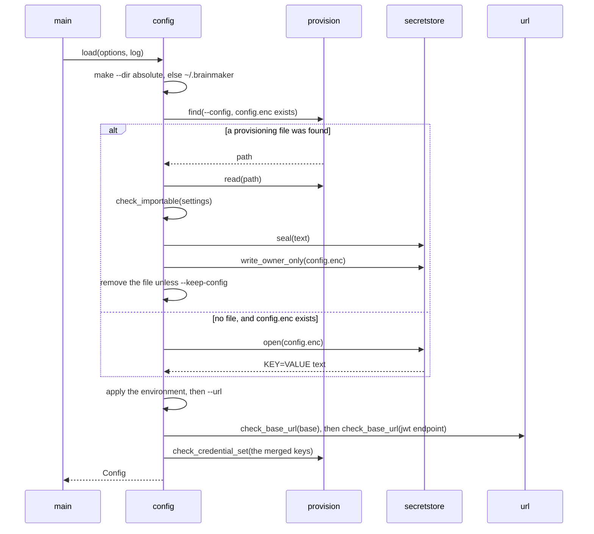
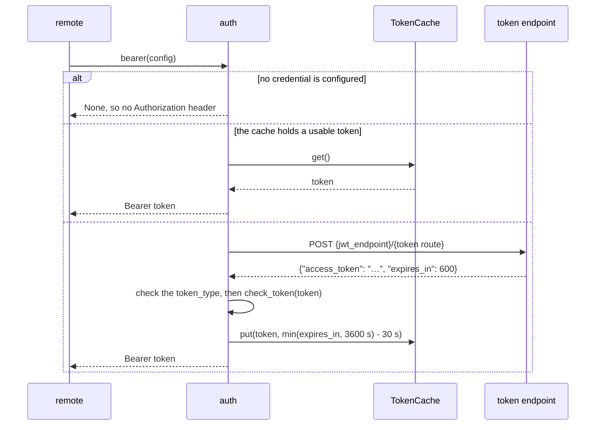
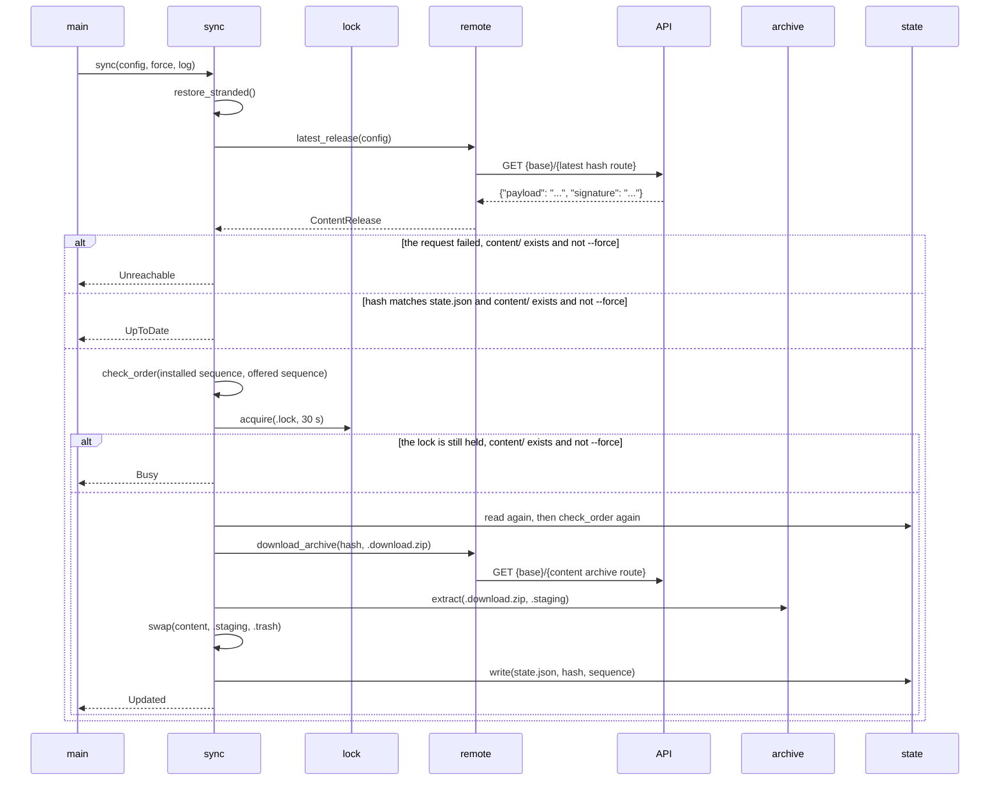

# Flow

Six runtime paths matter: loading the settings, getting an access token, the `sync` command, the
`self-update` command, `link` with its hourly agent, and the `uninstall` command. `status` reuses
the first two paths and then reads both remote endpoints without writing anything. Because it
writes nothing, an endpoint it cannot reach becomes a value it prints rather than a reason to exit:
[`main.rs:209`](../src/main.rs) prints `latest    <unknown>` and `state     cannot check: <reason>`.

## Settings load

Every command but `uninstall` starts here. `Config::load` runs before the dispatch in
[`src/main.rs:100`](../src/main.rs).

```mermaid
sequenceDiagram
    participant main
    participant config
    participant provision
    participant secretstore
    main->>config: load(options, log)
    config->>config: make --dir absolute, else ~/.brainmaker
    config->>provision: find(--config, config.enc exists)
    alt a provisioning file was found
        provision-->>config: path
        config->>provision: read(path)
        config->>config: check_importable(settings)
        config->>secretstore: seal(text)
        config->>secretstore: write_owner_only(config.enc)
        config->>config: remove the file unless --keep-config
    else no file, and config.enc exists
        config->>secretstore: open(config.enc)
        secretstore-->>config: KEY=VALUE text
    end
    config->>config: apply the environment, then --url
    config->>url: check_base_url(base), then check_base_url(jwt endpoint)
    config->>provision: check_credential_set(the merged keys)
    config-->>main: Config
```

Steps:

1. [`config.rs:357`](../src/config.rs) resolves the root through
   [`config.rs:259`](../src/config.rs): `--dir` made absolute, else `~/.brainmaker`.
2. [`provision.rs:320`](../src/provision.rs) searches up to four locations in order and returns the
   first hit. A `--config` or `$BRAINMAKER_CONFIG` path that is not a file fails the run. The fourth
   location, the working directory, is searched only while `config.enc` does not yet exist.
3. On a hit, [`config.rs:364`](../src/config.rs) reads the file, and
   [`config.rs:365`](../src/config.rs) checks the credential values and the five routes through
   [`config.rs:234`](../src/config.rs). A file that fails here changes nothing: the previous store
   and the file itself stay in place.
4. [`config.rs:367`](../src/config.rs) seals the parsed settings, and
   [`config.rs:368`](../src/config.rs) writes `confidential/config.enc` with mode `0600` inside a
   `0700` directory.
5. [`config.rs:374`](../src/config.rs) logs a warning when the system gives no machine identifier,
   because the store is then bound to the home directory path or to nothing.
6. [`config.rs:386`](../src/config.rs) removes the plain file. A failed removal logs a warning and
   the run continues, because the settings are already stored.
7. With no hit and an existing store, [`config.rs:415`](../src/config.rs) decrypts it. A store from
   another machine or another build fails here with a message that tells you to reimport.
8. [`config.rs:429`](../src/config.rs) lets `BRAINMAKER_API_BASE`, `SWETSI_JWT_ENDPOINT`,
   `SWETSI_CLIENT_ID`, and `SWETSI_CLIENT_SECRET` override the stored values, and
   [`config.rs:440`](../src/config.rs) lets `--url` override the base URL again.
9. [`config.rs:444`](../src/config.rs) and [`config.rs:456`](../src/config.rs) fail when no source
   supplied a base URL.
10. [`config.rs:464`](../src/config.rs) fails when the base URL is not `https://`, unless its host
    is this machine.
11. [`config.rs:468`](../src/config.rs) checks the merged credential set. Three keys, or none of
    them, passes. Any other count fails and names the missing keys. A configuration that still
    carries `SWETSI_TOKEN` and none of the three fails here.
12. [`config.rs:480`](../src/config.rs) builds the `Credentials`. It applies the TLS rule to
    `SWETSI_JWT_ENDPOINT`, and it refuses a credential value that cannot go into a header.
13. [`config.rs:487`](../src/config.rs) reads the five routes, and the environment overrides one
    route at a time. Each absent key takes its default. A route that holds `://`, a `..` segment,
    or a space fails here, because it would leave the base URL.

[`config.rs:424`](../src/config.rs) runs before steps 8 to 13 and fails when a configuration still
carries a key under its old name, such as `SWETSI_API_BASE`.

## Access token

`remote.rs` calls [`auth::bearer`](../src/auth.rs) before each request. The first call fetches, and
every later call in the same run reads the cache.

```mermaid
sequenceDiagram
    participant remote
    participant auth
    participant cache as TokenCache
    participant JWT as token endpoint
    remote->>auth: bearer(config)
    alt no credential is configured
        auth-->>remote: None, so no Authorization header
    else the cache holds a usable token
        auth->>cache: get()
        cache-->>auth: token
        auth-->>remote: Bearer token
    else
        auth->>JWT: POST {jwt_endpoint}/{token route}
        JWT-->>auth: {"access_token": "…", "expires_in": 600}
        auth->>auth: check the token_type, then check_token(token)
        auth->>cache: put(token, min(expires_in, 3600 s) - 30 s)
        auth-->>remote: Bearer token
    end
```

Steps:

1. [`auth.rs:141`](../src/auth.rs) returns `Ok(None)` when no credential is configured. The request
   then carries no `Authorization` header.
2. [`auth.rs:145`](../src/auth.rs) returns the cached token while it stays usable.
3. [`auth.rs:176`](../src/auth.rs) posts `grant_type=client_credentials&scope=sync` with HTTP Basic,
   and [`auth.rs:189`](../src/auth.rs) reads the response body up to 64 KiB.
4. [`auth.rs:200`](../src/auth.rs) refuses a `token_type` other than `Bearer`, in any case. A
   response with no `token_type` passes.
5. [`auth.rs:219`](../src/auth.rs) refuses a token that is empty, longer than 8192 bytes, or holds
   a character outside printable ASCII.
6. [`auth.rs:160`](../src/auth.rs) computes how long the client uses the token: `expires_in`, or
   600 seconds when the response has none, cut to at most one hour, less 30 seconds.
7. [`auth.rs:151`](../src/auth.rs) caches the token for that time. A lifetime that the clock cannot
   hold caches nothing, so the next request asks for a new token. The cache never reaches the disk.

A failed token request fails the command that asked for it. During `sync`, that happens before any
file changes, so `content/` stays as it was.

## Sync

```mermaid
sequenceDiagram
    participant main
    participant sync
    participant lock
    participant remote
    participant API
    participant archive
    participant state
    main->>sync: sync(config, force, log)
    sync->>sync: restore_stranded()
    sync->>remote: latest_release(config)
    remote->>API: GET {base}/{latest hash route}
    API-->>remote: {"payload": "...", "signature": "..."}
    remote-->>sync: ContentRelease
    alt the request failed, content/ exists and not --force
        sync-->>main: Unreachable
    else hash matches state.json and content/ exists and not --force
        sync-->>main: UpToDate
    else
        sync->>sync: check_order(installed sequence, offered sequence)
        sync->>lock: acquire(.lock, 30 s)
        alt the lock is still held, content/ exists and not --force
            sync-->>main: Busy
        else
            sync->>state: read again, then check_order again
            sync->>remote: download_archive(hash, .download.zip)
            remote->>API: GET {base}/{content archive route}
            sync->>archive: extract(.download.zip, .staging)
            sync->>sync: swap(content, .staging, .trash)
            sync->>state: write(state.json, hash, sequence)
            sync-->>main: Updated
        end
    end
```

Steps:

1. [`sync.rs:71`](../src/sync.rs) creates the root directory.
2. [`sync.rs:74`](../src/sync.rs) restores content that a stopped run left in `.trash/`, through
   [`sync.rs:271`](../src/sync.rs). It acts only when `content/` is missing, `.trash/` is a
   directory, and the install lock is free at once.
3. [`sync.rs:83`](../src/sync.rs) reads the signed content release. `remote::latest_release` checks
   the Ed25519 signature against `signature::CONTENT_KEYS`, and runs `config::validate_hash` on the
   hash from the signed payload, so an out-of-range value fails before it reaches a URL or a path.
4. [`sync.rs:86`](../src/sync.rs) turns a failed request into `Unreachable` when `state.json` names
   a hash, `content/` is a directory, and `--force` was not given. With nothing installed, or with
   `--force`, the error is returned instead.
5. [`sync.rs:97`](../src/sync.rs) returns `UpToDate` when the local hash matches, `content/` is a
   directory, and `--force` was not given. No archive is downloaded.
6. [`sync.rs:107`](../src/sync.rs) applies the order rule of [`sync.rs:154`](../src/sync.rs) when
   the offered hash differs from the installed hash and `--force` was not given. The run fails when
   the installed release has a sequence and the offered one is not higher, or has none.
7. [`sync.rs:112`](../src/sync.rs) takes the exclusive lock on `.lock`, and waits up to 30 seconds
   for another run to release it. When the lock is still held, [`sync.rs:114`](../src/sync.rs)
   returns `Busy` if content is installed and `--force` was not given, and an error otherwise.
8. [`sync.rs:126`](../src/sync.rs) reads `state.json` again, because the run that held the lock may
   have installed a release. [`sync.rs:127`](../src/sync.rs) returns `UpToDate` when it installed
   this one, and [`sync.rs:130`](../src/sync.rs) applies the order rule again to the state as it
   stands now.
9. [`sync.rs:135`](../src/sync.rs) picks the sequence to record. A reinstall of the installed hash
   keeps the higher of the installed and the offered sequence.
10. [`sync.rs:189`](../src/sync.rs) clears `.staging`, `.trash`, and `.download.zip` left by a run
    that failed between steps.
11. [`sync.rs:194`](../src/sync.rs) streams the archive to `.download.zip`, stopping at 512 MiB.
12. [`sync.rs:200`](../src/sync.rs) compares the byte count, and
    [`sync.rs:207`](../src/sync.rs) the SHA-256, against the signed release, before the extractor
    opens the file.
13. [`sync.rs:210`](../src/sync.rs) extracts to `.staging`. Rejected entries are counted, not fatal;
    the log line reads `Skipped N unsafe archive entries.`
14. [`sync.rs:222`](../src/sync.rs) swaps the directories.
15. [`sync.rs:227`](../src/sync.rs) removes the three temporary paths, on success and on failure
    alike.
16. [`sync.rs:233`](../src/sync.rs) writes `state.json` with the hash and the sequence, only after
    the swap succeeded. The lock is released when `sync` returns.
17. [`main.rs:132`](../src/main.rs) runs the software check unless `--no-update-check` was given.

### The swap and its rollback

[`sync.rs:244`](../src/sync.rs):

1. Rename `content/` to `.trash/`, when `content/` exists.
2. Rename `.staging/` to `content/`.
3. If step 2 fails and step 1 ran, rename `.trash/` back to `content/` and return the error.

A run that is killed between steps 1 and 2 leaves no `content/`. Step 2 of the next `sync` renames
`.trash/` back.

### Failure paths in sync

| Failure | Result |
|---|---|
| The server cannot be reached, and content is installed | Two `notice:` lines go to stderr and the exit code stays 0 |
| The server cannot be reached, and no content is installed | The run fails; nothing on disk changed |
| The content release fails the `CONTENT_KEYS` signature check | The run fails; nothing on disk changed |
| The response is not a signed envelope | The run fails; nothing on disk changed |
| The hash is not 8 ASCII alphanumeric characters | The run fails before any URL is built |
| The offered sequence is not higher than the installed one | The run fails; nothing on disk changed. `--force` installs it. |
| Another run holds the lock for 30 seconds, and content is installed | Two `notice:` lines go to stderr and the exit code stays 0 |
| Another run holds the lock for 30 seconds, and no content is installed | The run fails; nothing on disk changed |
| The download body exceeds 512 MiB or is empty | The partial file is deleted and the run fails |
| The archive size or SHA-256 differs from the signed release | The run fails; `content/` is untouched |
| The archive is not a zip | The run fails; `content/` is untouched |
| One entry expands past 256 MiB, or the archive past 1 GiB | The run fails; `content/` is untouched |
| The second rename fails | The previous `content/` is restored, then the run fails |
| `state.json` cannot be written | The content is installed, and the run fails with that stated |
| The software check fails, including on a bad signature | A `notice:` line goes to stderr and the exit code stays 0 |

## Self-update

```mermaid
sequenceDiagram
    participant main
    participant selfupdate
    participant remote
    participant API
    participant signature
    participant staged as staged binary
    participant link
    main->>selfupdate: check(config)
    selfupdate->>remote: fetch_text(the software manifest route)
    remote->>API: GET {base}/{software manifest route}
    API-->>selfupdate: {"payload": "...", "signature": "..."}
    selfupdate->>signature: verify(payload, signature)
    selfupdate->>selfupdate: parse payload, validate version, pick platform key
    main->>selfupdate: apply(config, version, build)
    selfupdate->>selfupdate: check the sha256, take .update.lock
    selfupdate->>selfupdate: binary_url(version, platform) from the base URL
    selfupdate->>selfupdate: remove leftovers, check_writable(install directory)
    selfupdate->>remote: download(the derived URL, .brainmaker-update-<pid>)
    selfupdate->>selfupdate: sha256_of(staged) == manifest sha256
    selfupdate->>staged: run --version
    staged-->>selfupdate: brainmaker <latest>
    selfupdate->>selfupdate: swap(exe, staged, .brainmaker-old)
    selfupdate->>link: copy_program(exe, <root>/bin/brainmaker)
```

Steps:

1. [`selfupdate.rs:123`](../src/selfupdate.rs) reads the envelope, stopping at 1 MiB.
2. [`selfupdate.rs:132`](../src/selfupdate.rs) checks the Ed25519 signature over the `payload`
   bytes, against the keys in `signature::PUBLIC_KEYS`. A manifest that no key accepts stops here,
   so nothing below ever sees it. A build with no key stops here too.
3. [`selfupdate.rs:135`](../src/selfupdate.rs) parses the verified `payload` into the manifest.
4. [`selfupdate.rs:142`](../src/selfupdate.rs) rejects a version string that is empty, longer than
   64 characters, or holds a character outside `[A-Za-z0-9.+-]`.
5. [`selfupdate.rs:151`](../src/selfupdate.rs) returns `UpToDate` when the manifest version is not
   newer. `--force` then reinstalls the same version, if the manifest has a build for this
   platform. A replayed older manifest therefore installs nothing, even with a valid signature.
6. [`selfupdate.rs:159`](../src/selfupdate.rs) looks up `<os>-<arch>`, for example `darwin-arm64`.
   A missing key yields `NewerElsewhere`, whose error names the keys that are present.
7. [`selfupdate.rs:194`](../src/selfupdate.rs) rejects a checksum that is not 64 hexadecimal
   characters.
8. [`selfupdate.rs:197`](../src/selfupdate.rs) takes the exclusive lock on `.update.lock` under the
   root, and waits up to 30 seconds. A lock that is still held fails the run.
9. [`selfupdate.rs:205`](../src/selfupdate.rs) derives the download URL from the base URL and
   `BRAINMAKER_SOFTWARE_BINARY_PATH`, filling in `{version}`, `{platform}`, and `{ext}`. The
   manifest names no URL, so it cannot move the download to another host.
10. [`selfupdate.rs:222`](../src/selfupdate.rs) removes every `.brainmaker-update-*` and
    `.brainmaker-probe-*` file in the install directory. A stopped update left them, and the lock
    means no other update owns them.
11. [`selfupdate.rs:223`](../src/selfupdate.rs) writes a probe file in the install directory, so a
    permission problem fails in about a second rather than after a large download.
12. [`selfupdate.rs:227`](../src/selfupdate.rs) downloads to `.brainmaker-update-<pid>`, stopping at
    128 MiB.
13. [`selfupdate.rs:231`](../src/selfupdate.rs) compares the streamed SHA-256 with the manifest.
14. [`selfupdate.rs:235`](../src/selfupdate.rs) runs the staged file with `--version`, and
    [`selfupdate.rs:392`](../src/selfupdate.rs) requires the trimmed output to be exactly
    `brainmaker <version>`. This catches a build for the wrong architecture and a manifest that
    points at the wrong file.
15. [`selfupdate.rs:238`](../src/selfupdate.rs) renames the running binary to `.brainmaker-old`,
    then renames the staged file into place. A failure on the second rename restores the old
    binary. A running process keeps its open image, so the swap is safe while `brainmaker` runs.
16. [`selfupdate.rs:241`](../src/selfupdate.rs) removes the staged file on failure, and removes the
    backup either way.
17. [`selfupdate.rs:248`](../src/selfupdate.rs) replaces `<root>/bin/brainmaker` as well, when that
    file exists and is not the file that ran. `link::same_file` decides that by canonical
    path. The `SessionStart` hook runs that copy, so an update that skipped it would leave every
    session on the old version.

`--check` stops after step 6 and installs nothing.

## Link and the hourly agent

```mermaid
sequenceDiagram
    participant main
    participant link
    participant schedule
    participant launchd
    main->>schedule: Agents::resolve(--agent-dir, --claude-dir given)
    main->>link: link(config, claude, agents, log)
    link->>link: link skills, copy the program, quote the command prefix
    link->>link: write the hook and the block, each through a rename
    link->>schedule: install(agents, prefix, root, log)
    alt the property list is unchanged
        schedule-->>link: false
    else
        schedule->>schedule: write the property list
        schedule->>launchd: bootout, then bootstrap, when it loads
        schedule-->>link: true
    end
    launchd->>launchd: each hour and at login, self-update then sync
```

Steps:

1. [`main.rs:109`](../src/main.rs) resolves the agent location through
   [`schedule.rs:60`](../src/schedule.rs). `--agent-dir` names a directory that is never loaded.
   Without it, [`schedule.rs:64`](../src/schedule.rs) returns no agent on a system other than
   macOS, or when `--claude-dir` was given.
2. [`link.rs:136`](../src/link.rs) fails when the content directory does not exist yet.
3. [`link.rs:144`](../src/link.rs) links the skills, and
   [`link.rs:145`](../src/link.rs) copies the program under the root.
4. [`link.rs:146`](../src/link.rs) builds the command prefix. [`link.rs:485`](../src/link.rs)
   writes each path as one double-quoted shell word, puts a backslash before `$`, the backtick,
   `"`, and `\`, and refuses a path that holds a control character.
5. [`link.rs:147`](../src/link.rs) writes the hook into `settings.json`, and
   [`link.rs:148`](../src/link.rs) writes the block into `CLAUDE.md`. A file that exists but cannot
   be read as text fails the run and stays as it is. A `CLAUDE.md` whose markers are not one start
   followed by one end fails the run too. [`link.rs:572`](../src/link.rs) writes each file through
   a temporary file and a rename, keeps the mode of an existing file, and keeps a symbolic link as
   a link.
6. [`link.rs:150`](../src/link.rs) installs the agent with the same command prefix the hook runs.
7. [`schedule.rs:103`](../src/schedule.rs) returns with nothing changed when the property list
   already holds the same text.
8. [`schedule.rs:109`](../src/schedule.rs) writes the property list.
   [`schedule.rs:114`](../src/schedule.rs) unloads an earlier copy, and
   [`schedule.rs:115`](../src/schedule.rs) loads the new one. A load failure prints a `notice:`
   line, and `link` still exits 0.
9. launchd then runs `/bin/sh -c` with the script that
   [`schedule.rs:148`](../src/schedule.rs) renders: `self-update --quiet`, then
   `sync --quiet --no-update-check`, joined by `;`, with the output in `<root>/agent.log`.

`unlink` runs the same resolve step, then `link::remove_bridge`, which unloads and removes the
agent before it removes the skill links, the hook entries, and the block. It removes each hook
entry that ends with `# brainmaker-link`, so a command of yours in the same group stays.

## Uninstall

```mermaid
sequenceDiagram
    participant main
    participant uninstall
    participant link
    participant disk as root directory
    main->>main: ask the question, unless --yes
    main->>uninstall: uninstall(layout, claude, agents, log)
    alt the root exists and holds neither mark
        uninstall-->>main: Report, unrecognised
    else
        uninstall->>link: remove_bridge(content, claude, agents)
        uninstall->>disk: remove content, temporaries, lock files, the program copy
        uninstall->>disk: remove state.json and config.enc
        uninstall->>disk: remove bin, confidential, the root, when empty
        uninstall-->>main: Report
    end
```

Steps:

1. [`main.rs:90`](../src/main.rs) sends `uninstall` down its own path before `Config::load`, so no
   setting is read and no provisioning file is imported.
2. [`main.rs:258`](../src/main.rs) fails when stdin is not a terminal and `--yes` was not given.
   Otherwise the question prints past `--quiet`, and any answer but `y` or `yes` exits 0 with
   `Nothing was removed.`
3. [`uninstall.rs:120`](../src/uninstall.rs) stops the run with nothing changed when the root
   exists and holds neither a parsable `state.json` nor a sealed `confidential/config.enc`.
4. [`uninstall.rs:132`](../src/uninstall.rs) resolves the running program before any file goes,
   so it can later say whether that program was the copy under the root.
5. [`uninstall.rs:137`](../src/uninstall.rs) removes the bridge through `link::remove_bridge`, the
   code that `unlink` runs. The LaunchAgent goes first, before the program copy it runs.
6. [`uninstall.rs:189`](../src/uninstall.rs) lists `content/`, `.staging/`, `.trash/`,
   `.download.zip`, `.lock`, `.update.lock`, `agent.log`, the program copy and every
   `bin/.brainmaker*` file, then the two temporary files and the two marks, in that order.
7. [`uninstall.rs:206`](../src/uninstall.rs) removes each path that exists. A symbolic link goes
   without its target. On Windows, a program copy that is running now yields a `notice:` line
   instead of an error.
8. [`uninstall.rs:225`](../src/uninstall.rs) removes `bin/`, `confidential/`, and the root when
   each one is empty, and names what the root still holds otherwise.
9. [`uninstall.rs:148`](../src/uninstall.rs) prints the path of the program that ran, unless it
   was the copy under the root, and [`uninstall.rs:154`](../src/uninstall.rs) asks you to restart
   any open Claude session when the hook was removed.

A removal that fails part-way returns the error, and the run exits 1. The marks go last, so the
next run still recognises the root and removes the rest. `uninstall` takes no lock, so do not run
it while a `sync` or a `self-update` runs.
